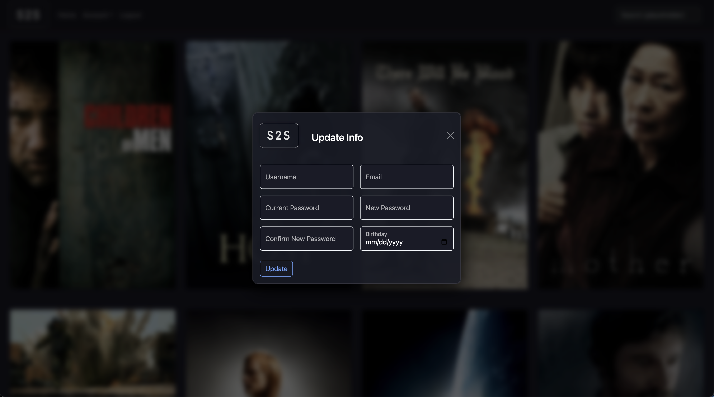

# Scene2Screen (S2S)

## Check out the live app [Scene2Screen](https://scene2screen.dev/)

## App Features

- Full stack movie database application with user authentication
- Browse movies with details:
  - Title
  - Description
  - Director
  - Genre
  - Release Year
  - Rotten Tomatoes score and streaming links (Apple TV & Amazon)
- Add or remove favorite movies
- View and update user profile information
- Delete user account
- Fuzzy search of movies by title

## Technology Used

- React (frontend)
- React Bootstrap
- Express.js (backend)
- MongoDB & Mongoose
- JWT Auth
- Passport.js
- Heroku / Netifly
- Git / GitHub

## Future Developments

- User submitted reviews
- User sorting of movies
- Email verification during user onboarding

## Learning Experience

- Built a full-stack MERN app from scratch
- Worked with protected API routes using JWT and Passport
- Managed user authentication and persisted sessions with localStorage
- Designed UI layouts with React Bootstrap
- Split large components into smaller modular ones
- Built and deployed RESTful API with custom endpoints

---

 
 
 
 
 
 
